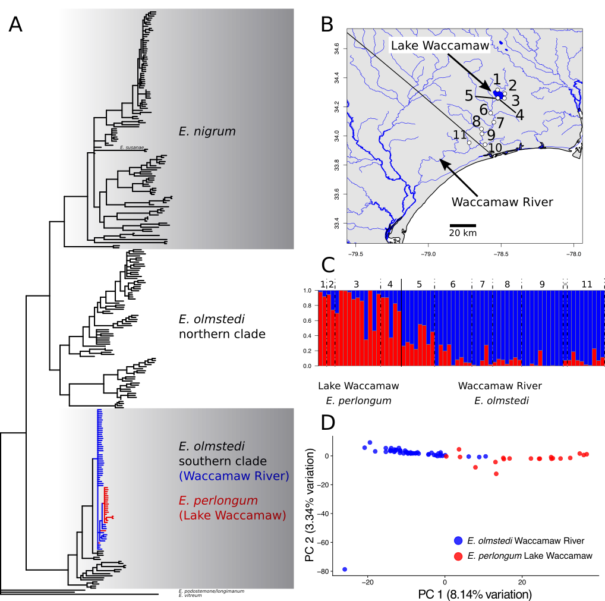

# DJM Final Project

link to final project presentation: https://docs.google.com/presentation/d/1Cj2cMghksd8KFY0QX1QT4nm68gL-UBkqfmLc4fXgGAA/edit?usp=sharing

## Instructions

This repository is a stub for your final project. Fork it as a template for your project, and develop your code in the forked repository. After you fork the repository, please enable the issue tracker in the repository settings so that others in the class (including the professor) can provide feedback. To submit the project, send a pull request to the original repository.

Expand on the readme questions below to provide an overview of the goals, background, and challenges for the final project. You can delete the questions as you write text that answers them, or leave the prompts in place. You can also delete this instruction section of you like.

Add all code to your project repository, including shell scripts, R analyses, python, etc.

Do not commit large data files to the repository. Provide paths to where they can be downloaded if they
are from public sources, or track them with [git-lfs](https://git-lfs.github.com).

## Introduction

This is a final project for the [Comparative Genomics](https://github.com/Yale-EEB723/syllabus) seminar in the spring of 2019. 
My project is to sequence and assemble the first darter genome using an Oxford Nanopore platform to collect long-read sequence data. 

## The goal

The long-term goals are to provide genomic resources for many future darter projects, including phylogenomic inference, functional genomics studies, and reference mapping. I will sequence a genome for *Etheostoma perlongum*, a species restricted to single lake in NC. The "sister species" of *E. perlongum* is *Etheostoma maculaticeps*, which can be found in the Waccamaw River that drains the lake. My specific goals are to use the genome to help assemble a large amount of ddRAD data that I have collected along a transect spanning the lake and the river. Our preliminary de novo assemblies and analyses of the ddRAD data indicate a steep cline between the lake and river, with some loci exhibiting particularly sharp breaks. My secondary goal is to map these outlier loci to the genomes to identify candidate regions that are maintaining the species boundary between the lake and river.

## The data

I have not collected the data yet, but plan to use an Oxford Nanopore PromethION platform to sequence one darter species to ~30x coverage.

## Background

Speciation commonly involves geographic isolation of lineages that limits or prevents gene flow1. The prevalence of allopatric speciation is exemplified by darters, a clade of ~250 North American freshwater fishes. Nearly all darter sister species pairs are isolated in different river drainages2. The only exception is *Etheostoma perlongum*. Endemic to the 36 km2 Lake Waccamaw in North Carolina, *E. perlongum* is phylogenetically nested within the widespread Etheostoma olmstedi (Fig. 1A). The closest *E. olmstedi* relatives of *E. perlongum* are found immediately outside of Lake Waccamaw in the Waccamaw River (Fig. 1B). A small spillway dam built in 1926 separates the lake from the river, but the dam is frequently inundated3. Despite the lack of dispersal barriers, my dissertation research indicates that there is a sharp geographic cline in allele frequencies between the lake and the river (Fig. 1C&D). Additionally, *E. perlongum* differs from *E. olmstedi* in the number of vertebrae, lateral line scales, body shape, and breeding habits, including an annual life cycle rarely observed in other darters4,5. 

*Figure 1.* Analyses of ddRAD-seq data for *E. olmstedi* and *E. perlongum*. A) Maximum likelihood phylogeny identified by IQTree, nodes <95% bootstrap support collapsed, red = *E. perlongum*, blue = *E. olmstedi* in the Waccamaw River. B) Sampling map, localities 1-4 in Lake Waccamaw, 5-11 in the Waccamaw River. C) Ancestry coefficients estimated using the “snmf” function in the R package LEA, locality numbers are indicated above the plot.  D) PCA, with points color coded by species designation. 

However, there is still debate whether *E. perlongum* is a distinct species or a lake ecomorph of *E. olmstedi*6. Lake Waccamaw is only 15,000-32,000 years old3, requiring very rapid ecological speciation between *E. perlongum* and *E. olmstedi*. Alternatively, the divergence between *E. olmstedi* and *E. perlongum* could be explained by local adaptation and/or phenotypic plasticity. Intraspecific lake-stream divergence is well-documented in many other fish species including sticklebacks7, minnows8, and cichlids9. If the divergence between *E. perlongum* and *E. olmstedi* represents intraspecific variation, we should observe similar genetic, phenotypic, and ecological divergence between other lake-stream populations of *E. olmstedi*. While there are many museum records of *E. olmstedi* in other lake-stream systems, there has been no detailed study of these populations. 

**Research Questions:** Is *E. perlongum* a unique case of recent ecological speciation in a clade dominated by allopatric speciation? Or is differentiation between *E. perlongum* and *E. olmstedi* typical of intraspecific variation between other *E. olmstedi* lake-stream populations?

Motivation for the project....

How it fits in with other work...

What the reader needs to know to understand the project

## Methods

I plan to perform the DNA extraction and sequencing in mid-March in the lab of Trevor Krabbenhoft, a collaborator at the University of Buffalo (http://arts-sciences.buffalo.edu/biological-sciences/faculty/faculty-directory/trevor-krabbenhoft.html). I will use a variety of base-calling and assembly methods, including Scrappie and Canu (outlined in Jain et al. 2018). I will hopefully perform genome annotation using several additional sources of data, including exon-capture sequences and transcriptomic data from a closely related darter species.

## Results

## Assessment

Was it successful in achieving the initial goal?

What are the main obstacles encountered?

What would you have done differently?

What are future directions this could go in?

## References

1. Coyne J.A. & Orr H.A. Speciation. Sunderland, MA: Sinauer Associates, Inc. 2004. 

2. Near T.J., Bossu C.M., Bradburd G.S., Carlson R.L., Harrington R.C., Hollingsworth, P.R., Keck, B.P., & Etnier, D.A. Phylogeny and temporal diversification of Darters (Percidae: Etheostomatinae). Syst. Biol. 60:565–595. 2011. 

3. Stager J.C. & Cahoon L.B. The Age and Trophic History of Lake Waccamaw, North Carolina. J. Elisha Mitchell Scientific Society. 103:1-13. 1987. 

4. Shute, P.W., Shute J.R., Lindquist D.G. Age, growth, and early life history of the Waccamaw Darter, Etheostoma perlongum. Copeia. 1982:561–567. 1982. 

5. Shute, J. R. A Systematic Evaluation of the Waccamaw Darter, Etheostoma perlongum Hubbs and Raney, with Comments on Relationships within the Subgenus Boleosoma Percidae: Etheostomatinae. University of Tennessee, Knoxville. 1984. 

6. Berner D., Adams D.C., Grandchamp A.C., & Hendry A.P. Natural selection drives patterns of lake-stream divergence in stickleback foraging morphology. J. Evol. Biol. 21:1653–1665. 2008. 

7. Collin H. & Fumagalli L. Evidence for morphological and adaptive genetic divergence between lake and stream habitats in European minnows (Phoxinus phoxinus, Cyprinidae). Mol. Ecol. 20:4490-4502. 2011 

8. Theis A., Ronco F., Indermaur A., Salzburger W., Egger B. Adaptive divergence between lake and stream populations of an East African cichlid fish. Mol. Ecol. 23:5304-5322. 2014. 

9. Wainwright P.C. & Richard B.A., Predicting patterns of prey use from morphology of fishes. EnvironBiolFish. 44:97-113. 1994. 
